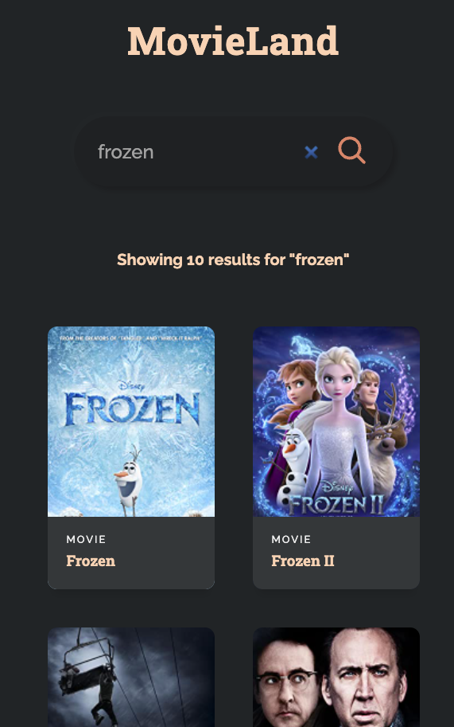

# [Movieland](https://movieland0.netlify.app/)

# Description

A site where you can search for movies and shows. Followed [this tutorial](https://www.youtube.com/watch?v=b9eMGE7QtTk).

# Technologies

React frontend. NodeJS backend (to hide api key). [Omdb API.](https://www.omdbapi.com/) Deployed with Netlify ❤️.

# Dependencies

## Frontend

- Axios
- Uuid (to give each MovieCard component a unique id)

## Backend

- Express
- Dotenv
- Cors
- Axios
- Nodemon (development)

# My own additions to this project:

- Added a loading wheel in the top-left corner. Visible during api fetches.
- Used onSubmit event to submit search as opposed to the tutorial's onClick
- For the 'no results' message, I also included the title that was searched for. My message: 'No results for 'exampletitle'.

# Learnings

- ## Hid API key (by building out simple NodeJS backend) See [this tutorial](https://www.youtube.com/watch?v=FcwfjMebjTU).

# Thoughts

- Netlify is amazing. Scary good.
  - Deployment was a breeze...default settings worked perfectly! After I chose which github repo to deploy, I only had to do one key thing: Add the environment variable (the api key). Hit deploy. Change site name. DONE.

# Next Steps

- see more than 10 results (before the user scrolls to the bottom, more movie results should load)
- authentication
- let users favorite movies
